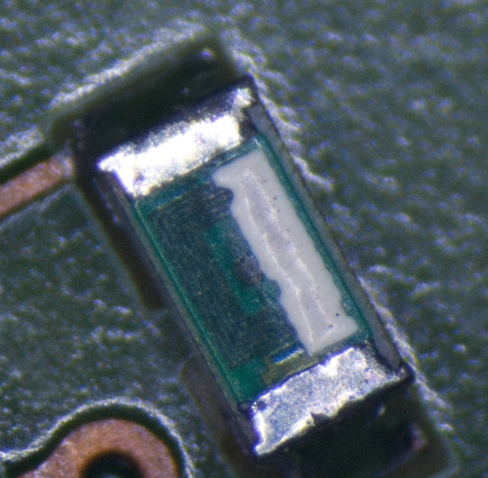
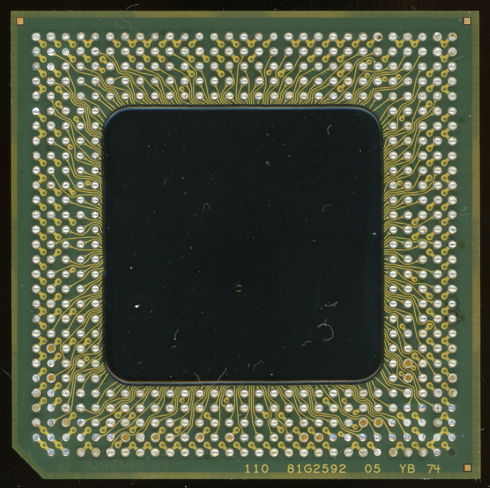

# Original 16717A PCB Reproduction

Note: While this board design is meant to match the original as closely as possible, I have not had it manufactured or tested.  Use at your own risk.

# Theory of Operation

You may also be interested in reading the official "Theory of Operation" section of the [Agilent manual](https://docs.alltest.net/manual/Alltest-Agilent-Keysight-16717A-ServiceManual-21826-.pdf), starting on page 146.  However I am hesitant to take anything it says at face value, because they describe some things which simply cannot be true based on the actual 16717A hardware.  I suspect that they probably started by copying the "Theory of Operation" section of a previous board (16712A maybe?) and missed some changes to how things work on the newer boards.  I'll try to note these issues below.

## Stackup
The 16717A uses an 8-layer board, four of which are signals:

* Layer 1 (top): components, signals
* Layer 2: ground
* Layer 3: +5V, -5.2V, ground
* Layer 4: signal
* Layer 5: signal
* Layer 6: +3.3V, -3.3V
* Layer 7: ground
* Layer 8 (bottom): components, signals

I wasn't able to determine individual core/prepreg thicknesses, but it didn't feel like any particular layers were significantly thicker than others, so I'm guessing the dielectric thickness of all FR4 layers is somewhere around 0.2mm.

## Input Conditioning & Comparators
Each signal coming in from the probe pods is length-matched and goes through an 0603 component which I can't identify, but they appear to be some kind of inductor.  At first I thought these might be fuses, but after looking at them under a microscope, it's clear they feature a spiral planar coil with 6 turns.  My LCR meter just says they're 0.1 ohm resistors.

Next each signal is terminated to ground through a 10k resistor, and further conditioned by several RC networks before being fed into one of 8 high speed comparator ASICs (part number 1NB4-5036).  Each chip has 9 signal inputs (8 data bits + 1 clock).  Each probe pod has 16 data bits and only 1 clock, so only half the comparators actually use all the inputs; the others have one input grounded.  There is also a test clock input, and when enabled it overrides the signals on all of the inputs.

The reference voltage for each chip can be configured independently, coming from an AD7841 8-channel DAC.  Interestingly, while the DAC has 8 outputs, each corresponding to one comparator chip and half of a pod's data signals, it seems there's no way in software to set half of a pod to a different threshold than the other half.

The outputs from the comparators are a rather strange ECL variant which uses `Vcc` at 3.3V and `Vee` at -5.2V.  `Vbb` is therefore approximately the same as for LVPECL; around 2.1V.  The clock signal outputs are complementary (i.e. differential) and all others are single-ended.

## Probe Power & I2C
Each pod connector receives 5V power via a TPS2011 high-side switch.  This provides current limiting in case of accidental short-circuit, and allows the power to be turned on or off as needed.  Each pod connector also contains an I2C bus, though I don't think the standard 40-pin probe cables actually connect anything to it.  The I2C bus is controlled by a PCF8584 and an analog switch to control which probe connector is currently being interrogated.

## Control FPGA & Backplane Interface
Most of the operation of the 16717A module is controlled directly by an Actel A32140DX FPGA.  The FPGA interfaces with the backplane bus, generates all of the DRAM refresh timing and control signals, and controls the two main data buses (the 16 bit memory data bus and 8 bit zoom data bus).  It also controls the comparator reference voltage DAC (through the memory data bus).

When used in a multi-module configuration, the FPGA on the master module can communicate with the FPGAs on the other modules using a 2 bit bus connected over the 20-pin ribbon cables.  This is probably some kind of serial connection; probably just a half-duplex SPI (clock + data).  It could be I2C, but if there were room to fit an I2C controller in the FPGA, they wouldn't need to use an expensive PCF8584 for the probe connector I2C bus.

The 16500A backplane bus had 8 dedicated bidirectional data lines and separate unidirectional address lines.  The 16700A service manual notes that the 16700 bus is backwards compatible with that, but has been extended to allow a 16b mode with multiplexed data/address.

There is also an 8b open collector bus, which I believe is what the service manual refers to as the IMB (inter-module bus) and is used for synchronizing triggers between modules.  This bus is interfaced with a 74FB2040 BTL buffer chip.  The FPGA drives the FB2040 TTL-level output signals, while the TTL-level input signals are sent to both of the acquisition ASICs.

## Timing Zoom Acquisition[^1]
The outputs from the comparators go through some custom resistor networks which split each signal into two.  One of the signals goes directly into the Timing Zoom chips (1NB4-5040).  These five chips each have 14 differential inputs.  For the single-ended signals (i.e. everything except the clocks) the inverting input is fed from the corresponding comparator's `Vbb` output, after it also goes through the same kind of resistor network as the signals.  I suspect these chips are mostly just high speed SRAMs with an address counter to fill them up automatically and some interface circuitry to allow them to be read out from an 8 bit bus.  The chips use only 3.3V power, and it would seem the 8 bit "zoom data bus" uses LVCMOS signaling.

Most of the zoom data bus signals are shared in common across all five chips, but each zoom acquisition chip does have one dedicated chip select (or possibly output enable?) signal, as well as a signal that's connected to one of the bits of the zoom data bus (but a different bit for each chip).  My best guess is that the latter signals are used to allow "multicast" commands to be sent to multiple chips at the same time.  This data bit signal is also delivered to each chip after being gated by a 74LVC08 chip, combining them with one of the shared control signals.  I have seen pictures of an early 16716A prototype board where the 74LVC08 chips were added dead-bug style with bodge wires, so apparently these are only there to work around some bug in the 1NB4-5040 silicon.

## Timing Zoom Clock Generation & Distribution[^1]
In order to ensure that all the timing zoom chips are synchronized (including potentially on multiple modules), they need to be clocked from the same source.  That source is a 101MHz PECL oscillator.  The signal is level shifted to LVPECL through DC-blocking capacitors and an LVPECL differential receiver, and then goes through a SY89421V PLL in 10x mode, resulting in a 1.01GHz differential LVPECL output.  That signal then goes to the HP 1821-4731 clock distribution ASIC, which buffers it out to each of the 20-pin ribbon cable connectors in the corner of the board.  It then comes back via the right-angle 20-pin connector, through another LVPECL buffer, and right back into the clock distribution ASIC again.  When using just a single board, this might seem silly, but it means that when using multiple modules, the clock from the "master" module is delivered to the clock distribution chip on each module with exactly the same propagation delay.  Finally, a pair of differential clocks are delivered to each of the five 1NB4-5050 chips.  Since the zoom clock is only 1GHz, but the timing zoom feature captures at 2GS/s, it might be that one of these clocks is just a 180-degree out of phase copy?  I don't have a scope fast enough to capture these signals, so I'm not sure.

The timing zoom distribution chip appears to be a fully bipolar design, using 5V ECL signaling for everything, except instead of the usual 5V PECL or -5V NECL schemes, it uses 3.3V `Vcc` and -1.7V `Vee`.  This is partly necessary because the zoom acquisition chips are only capable of receiving 3.3V signals, but as to why they didn't just design the part to use LVPECL with `Vee` connected to ground, I cannot guess.  Perhaps they originally designed this chip for something else where `Vcc` was 5V?

The clock distribution chip also connects to the zoom data bus, and has a bunch of control signals coming from the FPGA, but since these signals use normal TTL/CMOS signaling, they need to go through some resistor networks to massage them into something that the single-ended ECL inputs can detect.  Because of this, it is likely that this chip can't write anything back to the zoom data bus, it's likely only used to configure the zoom acquisition frequency (there is a configurable divider somewhere in there) and possibly configure how many clock pulses to generate when triggered.

There is one apparently ECL output from the zoom distribution chip.  It goes to an LM311 with the negative input held at 2.1V, and the result gets sent to the FPGA.  I have no idea what this might be used for, but it must not be anything timing sensitive, since the comparator will not react very fast.  Perhaps it's an error signal used to detect a failed oscillator/PLL?

Finally, the zoom clock distribution chip receives a signal from each of the two regular acquisition ASICs.  I suspect this is used to gate the zoom clock until the trigger condition has been detected.

## Test Clock Generation & Distribution
In addition to the differential zoom clock, the 20-pin ribbon cables also distribute a pair of LVNECL test clocks from the master module to each module.  This signal originates from the 100MHz backplane clock, divided down to either 50MHz or 25MHz by an MC10EL34 and MC100LVEL14.  Once on each module, the clocks go through a voltage divider and are sent into each of the comparator chips.  The test clock allows self tests to verify of most of the signal paths without needing any external equipment to inject signals.

## Acquisition ASICs[^2]

As mentioned above, the ECL outputs from the comparators are split in two, with one signal going to the zoom chips, and the other being routed through 80-100mm of microstrip to one of the two HP 1821-3936 chips (pictured above).  Each ASIC is responsible for sampling 34 channels (32 data + 2 clocks).  The clock signals use differential signaling, while the data signals are single-ended.  The `Vbb` voltage from each comparator is delivered to the acquisition ASIC, but pulled up slightly closer to 3.3V via a 1K/10K voltage divider, so instead of ~2.1V, the ASIC sees ~2.3V, and I'm not sure why.  The ECL signals should swing between 1.7V~2.5V, so 2.3V is likely still fine as a threshold as long as there isn't much noise.  Maybe the fall time of the single-ended ECL signals is significantly slower than the rise time (due to the emitter follower in combination with 50 ohm transmission line) so they wanted a threshold as close to `Voh` as possible?

The service manual states "All four state acquisition clocks are sent to each acquisition IC, and the acquisition ICs generate their own sample clocks," however this is not true; each acquisition ASIC only directly receives two of the pod clocks.  My best guess is that they're speaking somewhat metaphorically, and the other two are "sent" indirectly via the inter-module communication buses discussed below.

It appears that each clock and data input goes through an independently programmable delay line to account for any propagation delay differences between channels.  `pv`'s `calTest`  indicates that the delay can be adjusted in increments of 114ps.  The service manual has this to say:

> Every time the user selects the RUN icon, the acquisition ICs individually perform a clock optimization before data is stored.
>
> Clock optimization involves using programmable delays in the acquisition ICs to position the master clock transition where valid data is captured. This procedure greatly reduces the effects of channel-to-channel skew and other propagation delays.

It's unclear if this is done using the test clock enabled, or with actual signal data, but either way, this would seem to imply that trace length matching the input signals isn't necessary (at least after the comparator outputs), but it seems like the 16717A board designer did try to do length matching anyway.  Or rather, they superficially tried, but then gave up.  The signals for each ASIC are mostly length matched amongst themselves, but the ones on the left side are all about 20mm shorter than the ones on the right side, and even within each side, there are a few outliers that are over 5mm different from the other traces.

The ASICs are configured using the 16 bit memory data bus.  This would include things like the aforementioned delay lines, setting up the triggering and state clock FSAs, etc.

There are a number of control signals which go between the FPGA and the ASICs, and I mostly have no idea what specifically they are used for, but some of them are probably chip select, read/write, and clock for reading/writing registers over the memory data bus.

The ASICs also receive the 100MHz backplane clock. `pv`'s `bpClkTest` indicates that these chips contain a PLL capable of generating at least a 166.67MHz clock from this signal.  It's unclear what reference `bpClkTest` is using to measure these frequencies, since the comparator test clock is also based on the backplane clock.  Perhaps one of the control signals from the FPGA is a copy of the FPGA clock?  The service manual mentions that in (non-zoom) timing analysis, a 4-phase 125MHz clock is used, and later mentions:

> Also, the Test and Clock Synchronization Circuit generates a four-phase 125-MHz sample/synchronization signal for the acquisition ICs operating in the timing acquisition mode. At fast sample rates, the synchronizing signal keeps the internal clocking of the individual acquisition ICs locked in step with the other acquisition ICs in the module.

This is patently false.  There is no stand-alone PLL or oscillator capable of generating even one 125MHz clock, let alone a four-phase clock, and the 50/25MHz test clock cannot be delivered to the acquisition chips at the same time as real signals are being observed, so if such functionality exists, presumably these clocks are generated from the PLLs internal to the ASICs, based on the 100MHz system backplane clock.

The backplane contains an 8 bit BTL bus which I suspect is used when you set up "chained" triggers between isolated modules.  These signals can be driven from the FPGA, and are buffered and sent to both of the acquisition ASICs.  I believe this bus is what is used for `pv`'s `flagTest` and possibly also the `armTest`.

## Inter-Module Communication[^2]
The two acquisition ASICs communicate with each other, and with the ASICs on other modules, via a combination of single-ended parallel buses and differential serial buses.

The parallel signals are either two 24 bit buses (based on their routing and pin assignments on the BGA packages) or three 16 bit buses (based on the output of `pv`'s `icrTest`).
Half of the bits are routed between modules on the left 80 pin mezzanine connector, and the other half on the other connector.
The signals are terminated with pullups to 1.5V, and there is a resistor network set up to provide a reference at 2/3 of this termination voltage, which makes it look a lot like GTLP signaling.  Although snooping on some of the signals while running `icrTest` shows that they are driven all the way to 0V when low.  I don't have much experience with GTLP, but my understanding is that `Vol` should be more like 0.5V, so I'm not sure if they're really using GTLP drivers or just something similar.
Oddly, the 1.5V termination voltage is generated from a linear regulator which receives 5V through a long, winding PCB trace.  I guess the intent here was that it would act like an inductor/transmission line and help reduce noise?  There is also a footprint for a huge axial electrolytic cap on the plane side of this 5V trace.  It is unpopulated on production boards, but the 16716A prototype photos show it populated.

The differential serial signals are grouped into two sets of three differential pairs, and have separate transmit and receive pins on the ASICs.  The left ASIC appears to only be capable of transmitting to the three signals on the left mezzanine connector, and the same with the right ASIC and right mezzanine connector.  The signals from the mezzanine connectors are buffered by LVPECL receivers and then routed to both ASICs, so every ASIC can listen to both "sides" of the system, even if they can only transmit on one side.  The six pins that are used to transmit on the left side are different from the six pins used on the right side, and the "unused" set from the other side of the chip is connected across to the other ASIC, but not to the mezzanine connectors.  Each ASIC "knows" whether it is left or right, so it's possible these signals are six single-ended GTLP signals rather than three complementary pairs.  It's also possible that these could be used to allow the left chip to transmit on the right mezzanine connector's differential pairs, using the right ASIC as an intermediary, and vice-versa.

It appears someone tried to length-match the differential signals from the mezzanine connectors (after going through the LVPECL buffers) so that the delay to the left and right chips is identical.  But they only matched two of the three pairs.  I suspect that these signals correspond to the "master/slave/psync" clocks mentioned in the `clksTest` description in the service manual.  Unfortunately there's exactly no discussion of what these terms mean.  One might suppose that master and slave correspond to whichever clock is configured as master/slave in the GUI, but what does "psync" stand for?  Phase synchronization maybe?  If so what exactly does that mean?

## Sample Memory
Sampled state data is stored in dual port DRAM chips (OKI MSM5416283-50), storing 4Mbit each.  There are 34 total chips (not 18 as the service guide incorrectly says) for a total of 2M samples when using all 68 channels, or 4M samples if only using half the channels.  The chips are split evenly between the two ASICs, with 17 chips connected to each via nine independent "ports," with each port consisting of 16 data bits and a clock signal.  Eight of these ports are attached to the serial access port of two memory chips (i.e. two banks), while the final port is only attached to one chip (one bank).  This means the theoretical maximum write bandwidth is 7200 Mbit/s/ASIC.  At a state clock frequency of 333MHz, with 34 channels enabled, 11322 Mbit/s would be needed, so apparently they're either overclocking these chips, or else very high clock frequencies only work with some channels disabled.

The random access DRAM port, as well as all the memory control signals, are controlled directly by the FPGA, not the acquisition ASICs.  Most of the control signals are shared in common across all 34 chips, except RAS (shared by groups of 4 or 5 chips) and CAS (independently controlled on every chip) and the QSF outputs (only connected for each ASIC's port 9 chip).

[^1]: Timing Zoom circuitry is not populated on 16715A boards.
[^2]: The two HP 1821-3936 ASICs are mostly black boxes, so this section contains a lot of supposition and guesswork.
