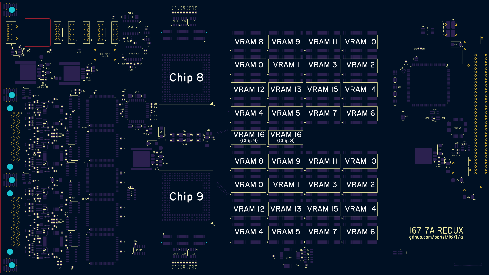

# 16717A Redux

TODO 3D render

# Quick Stats
* Dimensions: 366.75mm x 206mm x 1.6mm
* 10 layers
* 1250 components
* 9627 total pads
* 5392 total holes
* 3803 ~ 5048 filled & capped holes

# Tools

I would not recommend attempting to build one of these boards unless you have and know how to use the following equiment:

* 70W+ soldering station (I highly recommend something compatible with Hakko T12/T15 or JBC C210/C245 tips)
* IR preheater or temperature controlled hot plate (at least 100mm square)
* Hot air station (e.g. Quick 861DW)
* 1.27mm pitch BGA reballing tools (balls, stencil, etc.)
* Optical stereo microscope with 20x or higher magnification
* 22L ultrasonic cleaner (or larger; basket should be larger than 21cm x 37cm)

# Stackup

While reverse engineering the 16717A I noticed a lot of potential signal integrity issues:
* Most signals on the inner layers use +5V or +3.3V as a reference plane, but that is often not a power rail associated with the source and/or destination chips.
* Many signals move between front/back layers through vias without any nearby return path via.
* Many signals change between layers with different reference plane potentials without any nearby decoupling caps between the planes.

I'm sure that HP did a ton of testing to ensure there were no real world performance or EMI issues because of this, but since I don't know exactly what FR4 stackup they used, nor the dielectric constant of their core/prepreg layers, I decided it would be better to rework some things and go to a 10-layer design instead.  For small quantities of large size boards, 10-layer boards through JLCPCB are only a little more expensive than 8 layers (relatively speaking), and their default stackup for 10 layers is a bit nicer as well.

Here is the layer ordering I chose:

* Layer 1 (top): components, signals, -1.7V
* Layer 2: ground
* Layer 3: signals, +5V, -3.3V
* Layer 4: ground
* Layer 5: +3.3V, +5V, -3.3V, few signals
* Layer 6: +3.3V, +5V, -3.3V, ground
* Layer 7: ground
* Layer 8: signals, -5.2V, +3.3VP
* Layer 9: ground
* Layer 10 (bottom): components, signals

The most important goal here is to ensure that all signal layers are adjacent to ground plane layers.  No two signal layers are adjacent to each other, and all stripline layers have ground on both sides, not just one.  Additionally, since the board is quite large, the ground and power layers are symetrical to avoid any twist/bend from copper imbalance.  The inner lower layers (layer 5 and 6), rather than having having one +5V and one +3.3V layer, are routed with mostly identical planes covering only areas that need 5V and +3.3V separately, to avoid coupling noise from one rail to the other.

## JLCPCB Notes

Trace widths were selected assuming JLCPCB's default 10 layer stackup (JLC10161H-2116) with 1oz outer copper and 0.5oz inner copper.  If you choose to have it manufactured elsewhere, you might need to adjust them.  For reference, JLC10161H-2116 uses four 0.2mm cores (Er = 4.6) and five 4.7mil prepregs (Er = 4.16).

All 0.3mm holes should be epoxy filled and capped (JLCPCB should do this by default for 6+ layer boards).

JLCPCB will charge an extra $15 for any design with more than 4000 holes under 0.5mm in diameter.  This is listed on their "special cases" page, but it isn't described very clearly, and at the time of writing isn't included in their automated quoting tool.  To avoid hitting this limit, most power vias in the design have been set to 0.5mm.  All of the 0.5mm holes on the board _may_ be filled and capped, but it shouldn't be a problem if they are not.

Note that even working to avoid the extra drilling charges, JLCPCB will likely charge an additional $7.50 above their quoted price for this board.  After inquiring they informed me this was due to the large number of electrical test points, though they didn't tell me exactly what the limit is before that kicks in; I decided it wasn't worth pursuing that since there's not much I could do to reduce the number of pads in the design anyway.

# Bringup

It is by no means necessary to follow these exact procedures, however if you are concerned about parts having been potentially damaged in removal from the old board, this guide allows incrementally verifying some subsystems with a minimum of time sunk into soldering hundreds of passive components.

Note: I highly recommend checking all power rails for shorts after each step below, before powering up the mainframe.  The 167xx power supplies do not seem to have short-circuit protection.  I once accidentally plugged in an original 16717A "upside-down" and ended up blowing the PSU (and maybe the FPGA on the 16717A too; it wasn't working beforehand so I can't be sure).  I was using a ribbon cable backplane extender, and forgot that the mainframe was sitting on my desk upside down.  doh!  After replacing the PSU the mainframe still works fine, thankfully.  I was afraid I might have blown the backplane interface board as well, but it seems to still work fine.

## 0. Component Harvesting

For the vast majority of the passive components, you can just use new parts of the same value.  Indeed, since I replaced a bunch of resistors and SOIC resistor networks with more modern 0612 (4x0603) resistor networks, you'll need to use new parts for those.  But almost all the semiconductors and connectors used are either custom, obsolete, or expensive, so you'll need to salvage parts from a donor board (presumably non-working only because of trace/via corrosion).  In particular, you'll need:

* Actel A32140DX FPGA.  I recommend removing this with hot air rather than trying to use low-temp solder (e.g. ChipQuik).  These are one-time-programmable parts, so you need one specifically from a 16715A, 16716A, or 16717A; don't use one from another model of logic analyzer or go looking for one on eBay, etc, or you will be disappointed.
* 2x BGA ASICs with heatsinks.  The heatsinks are attached to a brass heat spreader using a thermally conductive "tape".  Heating it up to ~100C with hot air will soften the adhesive, allowing you to begin peeling off the heatsinks with a plastic spudger.  Once the heatsinks are removed, you can use a hotplate or hot air and a preheater to remove the BGAs themselves.  Once removed, clean up the pads and reball with 0.76mm balls.  Be careful not to use too hot an iron or drag it with too much force when cleaning up the pads; the soldermask used is slightly thicker than a normal PCB's, but it seems to be somewhat softer than a normal soldermask as well.
* 8x 1NB4-5036 comparators - custom HP part; can be reused from any HP logic analyzer using 40-pin (non-differential) probes.
* 5x 1NB4-5040 zoom FISO chips - custom HP part.
* 1821-4731 zoom clock distribution chip - custom HP part.
* 34x OKI MSM5416283 dual port DRAM chips - discontinued/obsolete.  On some of my boards, these chips show signs of rust on the pins of these chips, which I don't think is related to the corrosion on the bottom of the board.  I've done my best to clean and re-tin the legs with solder, but it makes me wonder if these will be the weak link that eventually causes most boards to fail once the trace/via corrosion has been removed from the equation.  On the bright side, with 34 of them on each board, sacrificing one board should provide spares to hopefully fix many others.
* SY89421V PLL chip - discontinued/obsolete.
* SN74FB2040 BTL transceiver - obsolete, though still available via Rochester Electronics at $300+ for a few dozen chips.
* AD7841 DAC - still available at time of writing, but costs $75 each in small quantities.
* 2x AD586 voltage references - still available at time of writing, but costs $12 each in small quantites.
* PCF8584 I2C controller - At time of writing, "last time buy" at DigiKey, and costs $7 each in small quantites.  I'm not actually sure if this part is even necessary; AFAIK the probe cables normally used with the 16717A do not actually connect anything to the I2C signals.
* ECL logic chips: 1x MC10EL34, 1x MC100LVEL11, 1x MC100LVEL14, 8x MC100LVEL16.  These are all still available new, but they're quite expensive.
* 12x MRF9511LT1 NPN transistors (SOT-143 packages near the inter-board connectors).  I'm not 100% certain that this is what these are, but based on the package code and "B E E C" on the silkscreen nearby (which matches the pinout of the MRF9511LT1) I'm fairly sure.  Unfortunately these are obsolete, so you'll need to remove and reuse them or find a modern part with similar specs.
* NEL HS-2810 101 MHz oscillator - discontinued/obsolete.  One of my boards has some rust on the case of this oscillator.  If necessary, you could probably make a small daughterboard with a modern 101 MHz oscillator with differential output to replace this.
* SG-615P 19.6608MHz oscillator - discontinued/obsolete, but I have adjusted the footprint for this oscillator so that any 19.6608 MHz oscillator with TTL output should fit.
* 5x through-hole ferrites & 2x SMD ferrites - these could probably be replaced with any other ferrites, but they're not hard to remove and reuse.
* 68x unknown input protection inductor/ferrite/fuse.  I have no idea what exactly these green and white 0603 components are, as my LCR meter just says they're 0.1 ohm resistors, but I suspect they're something more exotic.  They're marked as fuses in the schematic but they could easily be low value inductors/ferrites as well.
* 20x 4816P-B07-000 custom resistor networks.  4816P is/was a common series of SOIC resistor networks, but these are a decidedly nonstandard form, with each network containing four independent networks of three resistors each.  They could likely be replaced with discrete resistors, but it would require significant rework to the board layout.  Alternatively, you could probably make a small PCB with castellated pads in the shape of a SOIC-16 with the required discrete resistors.  But I'm just reusing these for now.
* 3x small heatsinks for LDOs.  These could probably be replaced with any other little glue-on heatsinks if you prefer.
* 4x 3M P08-080-SL-A-G mezannine connectors.  These are obsolete, but it may be possible to find some new-old-stock supplies still.  Otherwise, remove them very carefully with a preheater and relatively low-temp hot air.  I found that preheating to 150C and setting my station to 280C worked well.  Unfortunately, corrosion on the bottom on these boards sometimes destroys the gold plating on these connectors' contacts.  Of course, if you don't plan to use the board in a multi-module configuration, you can just ignore these.
* AMP 1-534204-4 backplane connector.  These are technically still actively produced, but are not stocked at any of the usual distributors, and are $19 each even when you order a whole box of 300.  So again, I chose to just remove the old one with hot air.  Alternatively, a regular 2x36 right-angle 0.1" header could be used, but the pins would need to be shifted a centimeter or so towards the front.  There is room for this, but it would require a lot of layout adjustments.
* 25 mil pitch ribbon cable & 6x connectors.  These could likely be replaced with different but similar parts.  If you're buying a non-working 16717A on eBay, etc, make sure to check if the ribbon cable is included.  I've found some of the test equipment dealers remove them inexplicably.
* 2x Probe cable connectors.  I've found some connectors with seem very similar to the ones HP/Agilent used, but not exactly compatible.  There might be some out there, or it might be possible to adjust the layout for a part with a slightly different layout, but the same connector form factor, but it's probably easiest to just salvage the original connectors.  Use kapton tape to avoid melting the part of the connector that peeks out over the edge of the board, then use hot air from the bottom side.  There are a lot of ground pins on these connectors, so using a preheater to bring the ground planes up to 100 or 150C is helpful.
* 4x PEM press-fit threaded nuts & back panel bracket.  These nuts are likely still available, but I'm not sure exactly what model number they are.  I recommend using a screw or standoff to remove these.  Hold the screw with pliers/vice-grips and rock back and forth until the inserts are free.  Note that removal will likely cause damage to the donor board.

## 1. FPGA

The first goal is to get a 16700A/B to recognize the board as a 16717A module, which indicates that the FPGA isn't completely dead, and is able to communicate with the backplane.  The main parts that need to be populated for this test are:

* The AMP 1-534204-4 backplane connector
* The +5V and +3.3V ferrites and bulk capacitors
* The Actel A32140DX FPGA (the large PQFP-208 package near the backplane connector) and some decoupling capacitors
* The 19.6608 MHz crystal oscillator which is the FPGA's main clock source
* Two of the ribbon cable connectors near the front and some associated resistors and capacitors (the FPGA needs these to determine whether it is the master or an extension board)

TODO add board images highlighting components that need to be populated

Once these components have been populated, the board should be selectable in `pv`, but all of the tests will fail:

```
$ pv
Shared Memory Segment 204 attached at Virtual Address: 0xc0dbf000
DMA Shared Memory is mapped to Physical Address: 0x4e9b000
Second half of DMA Shared Memory is mapped to Physical Address: 0x4c57000
RPC system Initialized (Program=700016505, Version=1)
pv> l
# Model 16702B
# System Memory=256 Mbytes, PCI device=1, PCI driver=1.01
Mod CPU: System CPU Board
Mod PCI: 16702B System PCI Board
Mod A  : Empty slot
Mod B  : (0x2e) 16717A 333MHz State/2GHz Timing Zoom 2M Sample
Mod C  : Empty slot
Mod D  : Empty slot
Mod E  : Empty slot
Mod 1  : Empty slot
Mod 2  : Empty slot
pv> s b
Module index=B
pv> x modtests
Mod   B: TEST FAILED       # "vramDataTest" (1, 1, -1)
Mod   B: TEST FAILED       # "vramAddrTest" (1, 1, -1)
Mod   B: TEST FAILED       # "vramCellTest" (1, 1, -1)
Mod   B: TEST FAILED       # "vramUnloadTest" (1, 1, -1)
Mod   B: TEST FAILED       # "chipRegTest" (1, 1, -1)
Mod   B: TEST FAILED       # "bpClkTest" (1, 1, -1)
Mod   B: TEST FAILED       # "cmpTest" (1, 1, -1)
Mod   B: TEST FAILED       # "icrTest" (1, 1, -1)
Mod   B: TEST FAILED       # "flagTest" (1, 1, -1)
Mod   B: TEST FAILED       # "armTest" (1, 1, -1)
Mod   B: TEST FAILED       # "vramSerDataTest" (1, 1, -1)
Mod   B: TEST FAILED       # "vramSerCellTest" (1, 1, -1)
Mod   B: TEST FAILED       # "clksTest" (1, 1, -1)
Mod   B: TEST FAILED       # "calTest" (1, 1, -1)
Mod   B: TEST FAILED       # "zoomDataTest" (1, 1, -1)
Mod   B: TEST FAILED       # "zoomMasterTest" (1, 1, -1)
Mod   B: TEST FAILED       # "fisoRedundancyTest" (1, 1, -1)
  Mod B: Unable to Detect WRAP Flag.  Possible Board Fault.
Mod   B: TEST FAILED       # "zoomAcqTest" (1, 1, -1)
  Mod B: Unable to Detect WRAP Flag.  Possible Board Fault.
  Mod B: Unable to Detect WRAP Flag.  Possible Board Fault.
  Mod B: Unable to Detect WRAP Flag.  Possible Board Fault.
  Mod B: Unable to Detect WRAP Flag.  Possible Board Fault.
Mod   B: TEST FAILED       # "zoomChipSelTest" (1, 1, -1)
```

Note: I don't recommend installing the back panel bracket/screws yet.  You can use zip ties to create pull loops for removing the board from a mainframe after testing.

## 2. Acquisition ASICs

By far the most difficult parts to solder are the two ASIC BGAs, so as soon as possible, we want to get them populated and verify that they haven't been destroyed by reflowing.  You may even want to do these before populating the FPGA components in the previous section.

If you're not comfortable reballing and soldering BGAs I'd suggest practicing on something less rare/useful first.  You may find the [`bga_stencil`](../bga_stencil/) directory useful when reballing the chips.  Once reballed, I found that soldering the chips with a hotplate only worked best.  Use polyimide tape to protect the soldermask while clamping the board to a hotplate (clamping is necessary to prevent any warping) and avoid using any hot air from above.  Too much heat can cause the interposer to warp slightly.  If this happens too much it may cause some of the outer balls to not make contact.  Heating only through the board itself helps prevent this.  Wait for the board to fully cool before unclamping it from the hotplate.

After soldering, use a multimeter in diode/resistance/continuity mode to check that each of the test points on the back side of the board has a solid connection to the chip.  There are also a few test points on the top side for signals that never traverse a via.

Once you are confident that all the BGA balls are attached properly, you can install the remaining components for the next test:

* Various resistors and capacitors underneath the ASICs (decoupling, pull ups, etc.)
* Optional: 3M P08-080-SL-A-G board-to-board connectors (these aren't really needed right now, but it may be easier to populate them before the various parts nearby)
* Transistors and ECL buffers near the board-to-board connectors near the edge of the board (used to synchronize clocks between the ASICs)
* Linear regulator for the +1.5V GTLP termination voltage, along with various associated resistors and capacitors
* MMBT3906 transistor and base resistor (allows FPGA to control biasing of inter-module clocks)
* 74FB2040 BTL transceiver, 74ABT540 inverting buffer, and associated passives (forwards async signals from the backplane/FPGA to the ASICs)
* ECL clock buffer for the 100 MHz backplane clock, along with associated passives and the -3.3V power rail passives
* Some additional passives near the FPGA, related to ASIC control signals

TODO add board images highlighting components that need to be populated

It's probably not necessary for testing at this point, but I would recommend reattaching the ASIC heatsinks with some thermal compound before any attempt to power up the board.  I forgot this during one test, yet after running `pv` tests and then idling for a few minutes and shutting down the system, the heatspreaders felt cold to the touch.  Yet HP put large heatsinks on these chips for a reason.  Perhaps they only put out significant heat when running a high speed acquisition, but better to be safe than sorry.

With these components now populated, `pv` should show the board passing `chipRegTest`, `bpClkTest`, `icrTest`, `flagTest`, and `armTest`:

```
$ pv
Shared Memory Segment 4 attached at Virtual Address: 0xc0dbf000
DMA Shared Memory is mapped to Physical Address: 0x4d85000
Second half of DMA Shared Memory is mapped to Physical Address: 0x4d89000
RPC system Initialized (Program=700016505, Version=1)
pv> s b
Module index=B
pv> x modtests
Mod   B: TEST FAILED       # "vramDataTest" (1, 1, -1)
Mod   B: TEST FAILED       # "vramAddrTest" (1, 1, -1)
Mod   B: TEST FAILED       # "vramCellTest" (1, 1, -1)
Mod   B: TEST FAILED       # "vramUnloadTest" (1, 1, -1)
Mod   B: TEST passed       # "chipRegTest" (1, 0, 1)
Mod   B: TEST passed       # "bpClkTest" (1, 0, 1)
Mod   B: TEST FAILED       # "cmpTest" (1, 1, -1)
Mod   B: TEST passed       # "icrTest" (1, 0, 1)
Mod   B: TEST passed       # "flagTest" (1, 0, 1)
Mod   B: TEST passed       # "armTest" (1, 0, 1)
Mod   B: TEST FAILED       # "vramSerDataTest" (1, 1, -1)
Mod   B: TEST FAILED       # "vramSerCellTest" (1, 1, -1)
Mod   B: TEST FAILED       # "clksTest" (1, 1, -1)
Mod   B: TEST FAILED       # "calTest" (1, 1, -1)
Mod   B: TEST FAILED       # "zoomDataTest" (1, 1, -1)
Mod   B: TEST FAILED       # "zoomMasterTest" (1, 1, -1)
Mod   B: TEST FAILED       # "fisoRedundancyTest" (1, 1, -1)
  Mod B: Unable to Detect WRAP Flag.  Possible Board Fault.
Mod   B: TEST FAILED       # "zoomAcqTest" (1, 1, -1)
  Mod B: Unable to Detect WRAP Flag.  Possible Board Fault.
  Mod B: Unable to Detect WRAP Flag.  Possible Board Fault.
  Mod B: Unable to Detect WRAP Flag.  Possible Board Fault.
  Mod B: Unable to Detect WRAP Flag.  Possible Board Fault.
Mod   B: TEST FAILED       # "zoomChipSelTest" (1, 1, -1)
```

If any of these tests fails, it's likely due to an unconnected BGA ball somewhere.  Try setting `d d=9` and/or `d r=9` and rerunning the failing test to get more details.  When `pv` refers to "Chip 8" it means the one closer to the ribbon cable connectors, test clock generation, and zoom clock circuitry.  "Chip 9" refers to the other ASIC.

## 3. DRAM

Next, populate the 34 DRAM chips, decoupling capacitors beneath them on the bottom side, and the RAS/CAS termination networks on the top side.

TODO add board images highlighting components that need to be populated

Once these have been populated, `pv` should report all the `vram*` tests passing, as well as `clksTest`, and all of the previously passing tests:

```
$ pv
Shared Memory Segment 203 attached at Virtual Address: 0xc0d5b000
DMA Shared Memory is mapped to Physical Address: 0x45b2000
Second half of DMA Shared Memory is mapped to Physical Address: 0x43cf000
RPC system Initialized (Program=700016505, Version=1)
pv> s c
Module index=C
pv> x modtests
Mod   C: TEST passed       # "vramDataTest" (1, 0, 1)
Mod   C: TEST passed       # "vramAddrTest" (1, 0, 1)
Mod   C: TEST passed       # "vramCellTest" (1, 0, 1)
Mod   C: TEST passed       # "vramUnloadTest" (1, 0, 1)
Mod   C: TEST passed       # "chipRegTest" (1, 0, 1)
Mod   C: TEST passed       # "bpClkTest" (1, 0, 1)
Mod   C: TEST FAILED       # "cmpTest" (1, 1, -1)
Mod   C: TEST passed       # "icrTest" (1, 0, 1)
Mod   C: TEST passed       # "flagTest" (1, 0, 1)
Mod   C: TEST passed       # "armTest" (1, 0, 1)
Mod   C: TEST passed       # "vramSerDataTest" (1, 0, 1)
Mod   C: TEST passed       # "vramSerCellTest" (1, 0, 1)
Mod   C: TEST passed       # "clksTest" (1, 0, 1)
Mod   C: TEST FAILED       # "calTest" (1, 1, -1)
Mod   C: TEST FAILED       # "zoomDataTest" (1, 1, -1)
Mod   C: TEST FAILED       # "zoomMasterTest" (1, 1, -1)
Mod   C: TEST FAILED       # "fisoRedundancyTest" (1, 1, -1)
Mod   C: TEST FAILED       # "zoomAcqTest" (1, 1, -1)
Mod   C: TEST FAILED       # "zoomChipSelTest" (1, 1, -1)
```

If `pv` reports errors for all chips on `vramDataTest` or `vramAddrTest`, it likely means that one or more of the memory data or address lines are shorted together, or shorted to one of the power rails.  The easiest way to track this down is with a DMM capable of precisely measuring low-ohm resistances (e.g. HP 3478A).  The location of a short will show very near 0 ohms, increasing by around 200 mOhm for the same pins on adjacent DRAMs, and up to several ohms for chips very far from the short.  Once you find the short, if there is no solder bridge, the chip is likely damaged internally.

If `pv` reports errors with only a specific chip, then the problem is likely an unconnected pin, cold solder joint, or internally broken bond wire.  this diagram may help track down which one is faulty:





## 4. Comparators & Test Clock Generator

To make progress on the rest of the `pv` tests, we need to get the internal test clock working.  To do this we need to populate:

* The 100LVEL14 clock buffer chip and related passives
* The 10EL34 clock divider chip and related passives
* The remaining ribbon cable connectors and some miscellaneous capacitors nearby
* All of the 1NB4-5036 comparator chips and related passives (though if you want to, you could save the input filtering RC networks for later, since they add up to around 400 individual parts, and aren't needed if you aren't measuring real signals)
* A variety of miscellaneous capacitors and resistors near the comparators
* All of the 4816P-B07-000 custom resistor networks
* Two TPS2011 high-side switches
* The -3.3V and -5.2V backplane ferrites and bulk capacitors
* Two small capacitors on the -12V and +12V rails, near the backplane connector
* The AD7841 DAC and two AD586 references, along with their associated passives
* The PCF8584 controller, 74CBT3125 mux, and a few remaining passives on the FPGA side of the board

TODO add board images highlighting components that need to be populated

At this point, the only parts not populated should be zoom-related, and we effectively have a 16715A board that thinks it's a 16717A.  Only the last five `pv` tests should fail:

TODO add pv output

TODO if you set the identification resistor for 16715A, does it pass all pv tests?

## 5. Timing Zoom

Once everything else is working, we can add the timing zoom components:

* 1NB4-5040 zoom FISO chips (5x)
* 74LVC08 quad AND gates (2x)
* 1821-4731 zoom clock distribution chip
* LM311 comparator
* NEL HS-2810 ECL zoom reference oscillator
* 100LVEL16 zoom reference clock buffer
* SY89421V zoom clock PLL
* 100LVEL16 zoom clock buffer (after ribbon cable)
* +3.3V and -1.7V linear regulators for the PLL and zoom clock chips
* All remaining passives (except the 16717A board identification resistor)

TODO add board images highlighting components that need to be populated

Once everything is complete, cross your fingers and hope that `pv` shows no failures:

TODO add pv output

There's only two things left to test now:
* Testing the board with real probes and signals.  I'll let you decide exactly how you want to do that.  If `pv` doesn't report any errors, but something isn't working, it's likely either a faulty comparator chip, a problem with one of the input filtering networks, or a bad probe/cable.
* Testing the board when used in a multi-card configuration.  Make sure both/all boards pass all `pv` tests in master configuration before attempting to use them together.  If `pv` reports errors in a multi-card configuration, but not when the boards are all masters, it probably means there's a problem with the circuitry near the board-to-board connectors, or the FFC connectors/cables themselves.

Once you're sure a board is fully working, you may want to remove the ASIC heatsinks and reapply them with thermal adhesive rather than regular thermal compound, to avoid the chance of them falling off if the mainframe is moved while the board is inside.  If you haven't yet installed the back panel bracket, do that now as well.

# Full Change List

* Stackup changed to 10 layers and added layer ID area in lower right corner
* Adjusted trace widths for JLCPCB's 10 layer stackup
* Removed debug connectors and test points
* BGA escapement and other areas use via-in-pad (epoxy filled vias)
* Added test points for electrically checking BGA connections after reflow 
* Added return path vias near signals that change layers, where possible
* Replaced almost all SOIC resistor packs and some discrete resistors with 4x0603 resistor arrays (except custom comparator output networks)
* Moved zoom oscillator closer to PLL
* Adjusted FPGA oscillator footprint to accept alternative packages (including DIP-8), since SG-615P is obsolete and I have a few boards where corrosion got to it
* Moved 1.5V ICR termination regulator to be adjacent to the ASICs that use it
* Moved zoom data bus to stay almost entirely on one inner layer and not to wrap around both edges of the board
* Zoom clocks coming from distribution chip are now exclusively on inner stripline layers
* LM2991 (-1.7V regulator for zoom distribution chip) now delivers power via a plane on the top layer
* ON/OFF pin on LM2991 is tied to GND pin as datasheet recommends
* ICR bus between ASICs is now on top and one internal layer, rather than top and bottom layers, freeing up the bottom layer for more flexible component placement & routing
* Inter-chip clock lines are now correctly length-matched
* Significantly changed power plane layout: 2 middle layers mostly devoted to +5V and +3.3V, -5.2V is on layer 8
* Unused inputs on 74LVC08 are grounded
* Removed length matching on ECL signals from comparators to acquisition BGAs.  Not all signals were matched to the same length, and the delay is automatically tuned for each signal individually anyway.
* Increased the values of a few ceramic decoupling caps
* Probe connectors now have mounting holes in case additional strain relief is desired

I also considered reworking some of the LDOs; in particular the LM2991 which is using +3.3VP as a virtual ground, since the LM2991 can't regulate close to its ground reference.  It seems strange that they didn't just use the 3-terminal LM337 instead, since -1.7V shouldn't be a problem for it.  The parts do have slightly different noise characteristics, but I can't see that being a problem here, as ECL is pretty tolerant to noise on `Vee`.  In the end, I decided to keep all the LDO circuits as-is, except for some layout adjustments.
